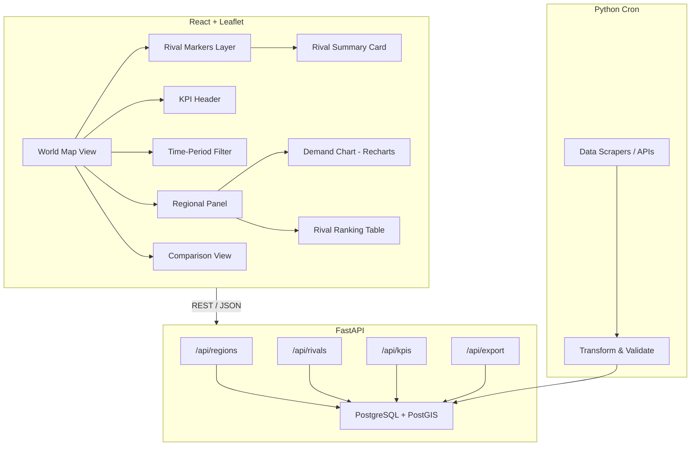
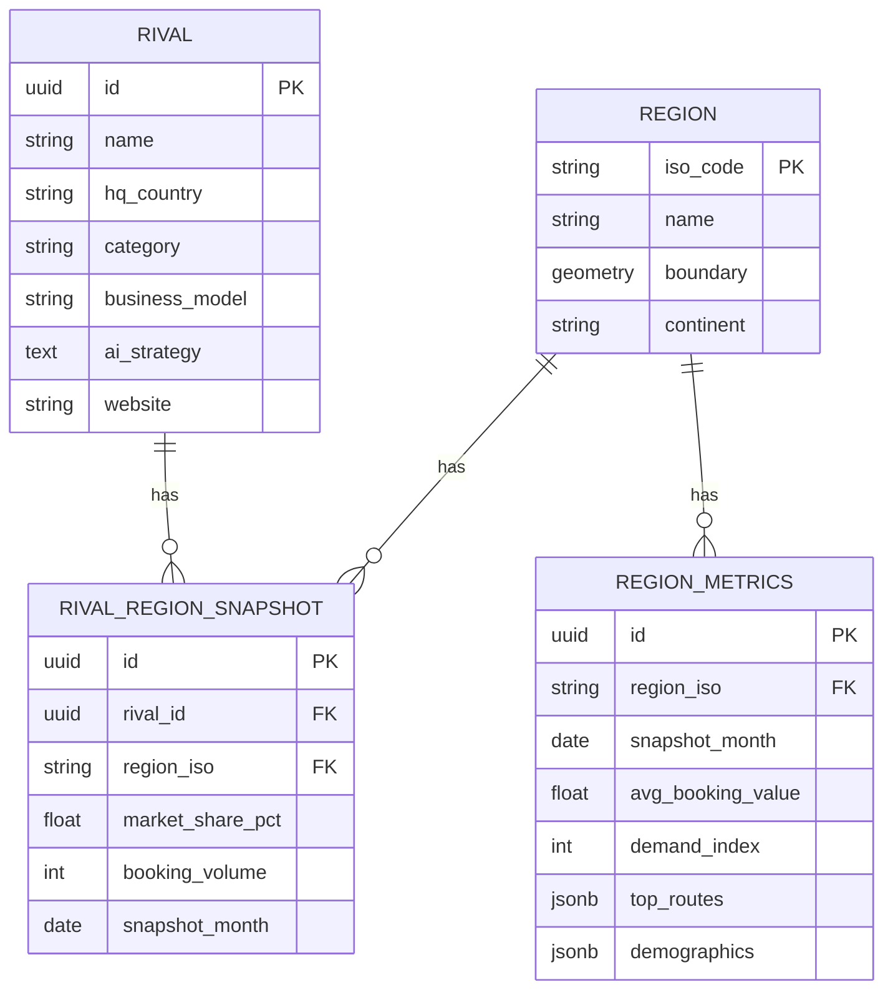

# System Design & Architecture

## Architecture Overview



## Project Structure

```text
OTA-Worldmap/
├── frontend/                          # React 19 + TypeScript (Vite)
│   ├── index.html                     # Vite entry document
│   ├── src/
│   │   ├── main.tsx                   # React root + global CSS import
│   │   ├── App.tsx                    # Layout shell (header + map)
│   │   ├── index.css                  # App styles + Leaflet CSS import
│   │   ├── types.ts                   # KPI + GeoJSON type definitions
│   │   ├── api/
│   │   │   └── regions.ts             # fetch wrapper for /api/regions
│   │   ├── components/
│   │   │   ├── WorldMap.tsx           # Leaflet map + choropleth layer
│   │   │   └── KpiSelector.tsx        # KPI dropdown
│   │   ├── stores/
│   │   │   └── kpiStore.ts            # Zustand store (selected KPI)
│   │   └── utils/
│   │       ├── colorScale.ts          # Choropleth color interpolation
│   │       └── colorScale.test.ts     # Vitest unit tests
│   ├── vite.config.ts
│   └── package.json
├── backend/                           # FastAPI + SQLAlchemy (async)
│   ├── app/
│   │   ├── main.py                    # FastAPI app + router registration
│   │   ├── config.py                  # Pydantic settings
│   │   ├── database.py                # Async engine + session factory
│   │   ├── base.py                    # SQLAlchemy declarative base
│   │   ├── models/
│   │   │   ├── region.py              # Region, RegionMetrics
│   │   │   └── rival.py               # Rival, RivalRegionSnapshot
│   │   └── routers/
│   │       └── regions.py             # GET /api/regions (GeoJSON + KPIs)
│   ├── migrations/                    # Alembic migration files
│   ├── alembic.ini
│   └── requirements.txt
├── data/
│   ├── geo/
│   │   └── countries.simplified.geo.json   # Boundaries for 233 countries
│   └── seeds/
│       └── seed.py                    # Rivals, regions, region_metrics
├── docs/
│   └── walkthrough.md                 # Per-phase implementation log
├── specs/
│   ├── user_story.md
│   └── implementation_plan.md
└── docker-compose.yml
```

## Data Model (Simplified)


