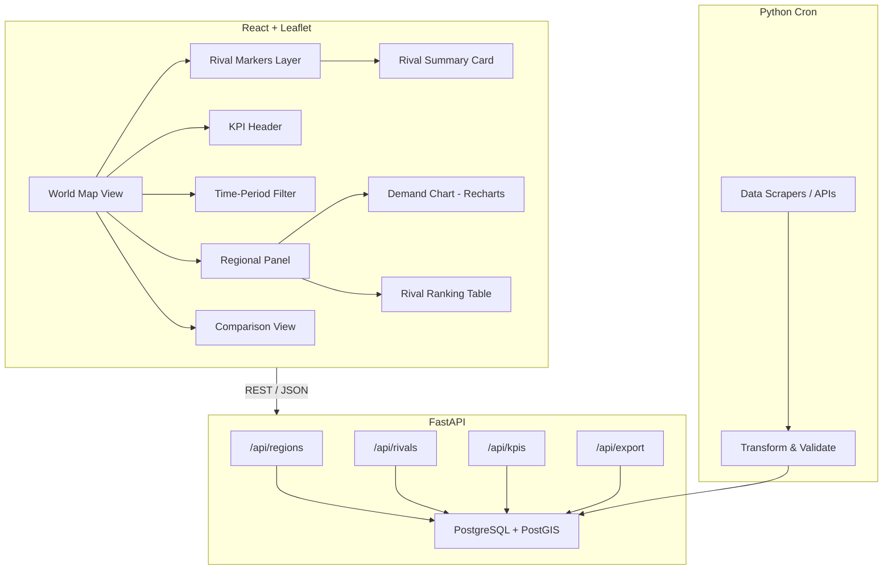
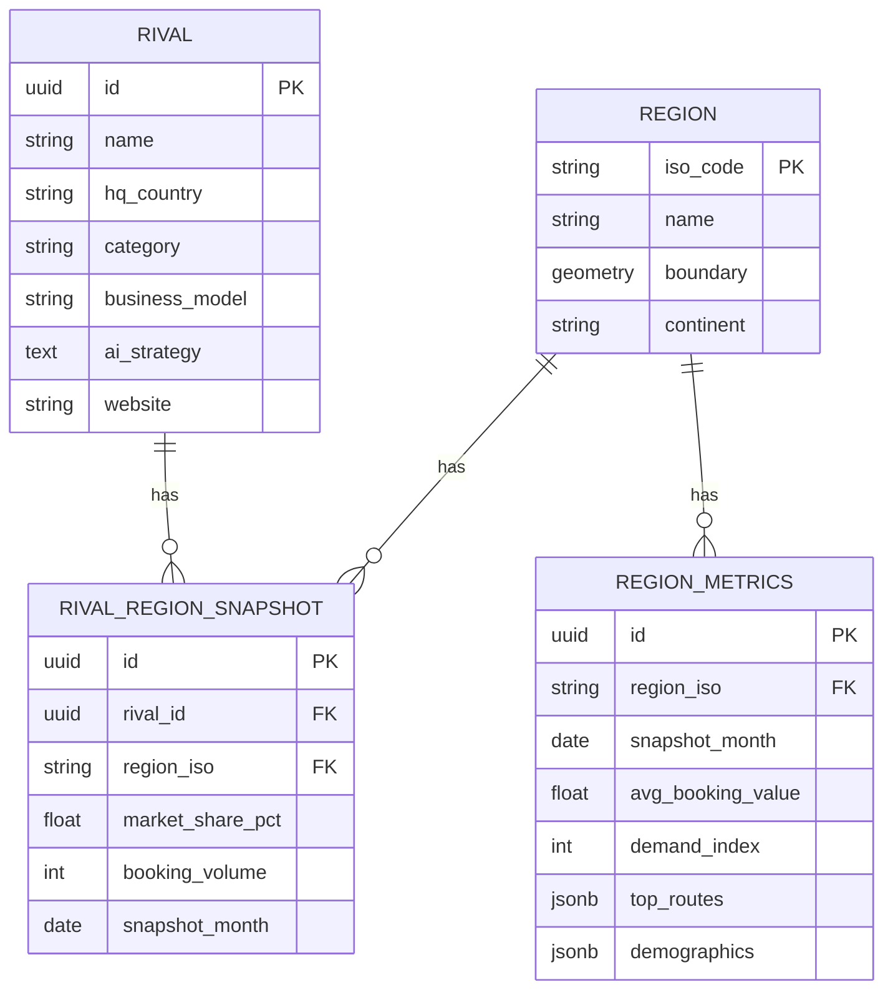

# Implementation Plan — OTA Competitive Intelligence Dashboard

**Version:** 1.0
**Last Updated:** 2026-04-18
**Source Spec:** [specs/user_story.md](user_story.md)

---

## 1. Executive Summary

Build a world-map-based competitive intelligence dashboard for the OTA president to monitor rival companies and regional travel market characteristics, prioritizing a working map core before layering analytics on top.

---

## 2. Tech Stack Decision

| Layer | Choice | Rationale |
|---|---|---|
| Frontend Framework | React 19 + TypeScript | Type safety, ecosystem maturity |
| Map Library | Leaflet (react-leaflet) | Open-source, free, and lightweight mapping |
| Charts | Recharts | Lightweight, React-native, composable |
| State Management | Zustand | Simple, minimal boilerplate for dashboard state |
| Backend API | Python + FastAPI | Fast prototyping, async I/O, auto-generated docs |
| Database | PostgreSQL + PostGIS | Relational + geospatial queries |
| Data Ingestion | Python scripts + cron | Scraping/API fetch pipeline, monthly cadence |
| Hosting | Vercel (frontend) + Railway (backend) | Fast deployment, free tier for prototype |

---

## 3. Architecture Overview

---

## 4. Data Model (Simplified)

---

## 5. Phase Plan

### Phase 0 — Project Setup

**Goal:** Runnable skeleton, CI, and seed data loaded.

| Task | Output | Acceptance Criteria | Verification (検証方法) |
|---|---|---|---|
| Create monorepo structure | Repo scaffold | `/frontend`, `/backend`, `/data` folders exist | `ls -R` directory check |
| Configure Linting/TypeScript | Config files | Strict mode enabled, zero lint errors | `npm run lint` and `tsc --noEmit` |
| Set up PostgreSQL + PostGIS | DB running | Local and Railway instances accessible | `psql -c "SELECT version();"` |
| Database Migrations | `migrations/` | Schema matches Data Model (Section 4) | `\d` command to verify tables |
| Seed Database | Seed script | 9 rivals and 30 countries loaded | `SELECT COUNT(*)` count check |
| Configure CI/CD | Pipeline | Preview deployments active on Vercel | PR trigger + preview URL validation |

**Milestone:** `http://localhost:3000` loads a blank page and DB connectivity is confirmed.

---

### Phase 1 — Interactive World Map Core

**Goal:** Satisfy FR-01 fully.

| Task | Output | Acceptance | Verification |
|---|---|---|---|
| Leaflet Integration | Map renders | Map visible with OSM tiles | Manual visual check |
| Zoom / pan controls | Controls | Zoom 2–10 works smoothly | Manual interaction trace |
| Fetch /api/regions | Boundaries | All 195 borders drawn | Browser console: GeoJSON check |
| KPI Choropleth | Color layer | Dropdown switches KPI, colors update | Visual vs expected palette |
| Hover Tooltips | Tooltip | Appears within 200ms | Performance monitor (DevTools) |
| KPI Scale Unit Tests | Tests | 100% pass | `npm test` or `vitest` |

**Milestone:** World map with color-coded KPI choropleth is live in staging.

---

### Phase 2 — Rival Company Overlay

**Goal:** Satisfy FR-02 fully.

| Task | Output | Acceptance | Verification |
|---|---|---|---|
| Backend /api/rivals | API | Returns JSON in < 200ms | Postman: Response time check |
| Rival markers | Markers | 9 seed rivals visible | Visual marker count check |
| Marker clustering | Clustered pins | No overlap at zoom < 5 | Manual zoom-out verification |
| Rival summary card | Card component | Card opens within 300ms | Interaction profiling |
| Category filters | Filter UI | Markers update on toggle | Toggle each category manual test |
| Rival Playwright Test | E2E test | Passes in CI | `npx playwright test` |

**Milestone:** All 9 seed rivals are clickable on the map with summary cards.

---

### Phase 3 — Regional Characteristics Panel

**Goal:** Satisfy FR-03 fully.

| Task | Output | Acceptance | Verification |
|---|---|---|---|
| Backend /api/regions/:iso | API | Returns metrics + demographics | JSON Schema validation |
| Side panel slide-in | Panel component | Opens in < 400ms | Visual transition audit |
| Seasonal demand chart | Chart | 12-month data plotted | DB vs UI data point sample |
| Demographics breakdown | Demographics | Segments sum to 100% | Unit test for donut logic |
| Close / collapse UX | Dismiss button | Panel closes, map re-centers | Click-path regression test |

**Milestone:** Clicking any country opens a panel with demand chart and rival ranking.

---

### Phase 4 — KPI Header + Comparison View

**Goal:** Satisfy FR-04 and FR-05.

| Task | Output | Acceptance | Verification |
|---|---|---|---|
| Backend /api/kpis/global | API | Returns 3 global KPIs | `curl` JSON verify |
| KPI header bar | Header component | Updates when filters change | Filter integration test |
| Multi-select picker | Select widget | Enforces max 3 countries | Manual selection edge-case test |
| Comparison table | Table | Columns align per selection | Cross-reference table data |
| Highlight winner cell | Visual diff | Highest value is green | Manual data check |

**Milestone:** President can compare 3 regions in a table with a single click flow.

---

### Phase 5 — Time-Period Filter + Export

**Goal:** Satisfy FR-06.

| Task | Output | Acceptance | Verification |
|---|---|---|---|
| Time range slider | Filter widget | UI re-fetches on change | Network tab verification |
| Backend query param | API update | Filtered data returned | API direct query verification |
| Backend /api/export | Export API | Returns valid CSV | Check CSV in spreadsheet app |
| PDF export (jsPDF) | PDF button | PDF contains map + tables | Manual PDF audit |
| "Last updated" badge | Timestamp | Shows ingestion date | UI vs DB timestamp match |

**Milestone:** Full filter + export flow works end-to-end.
